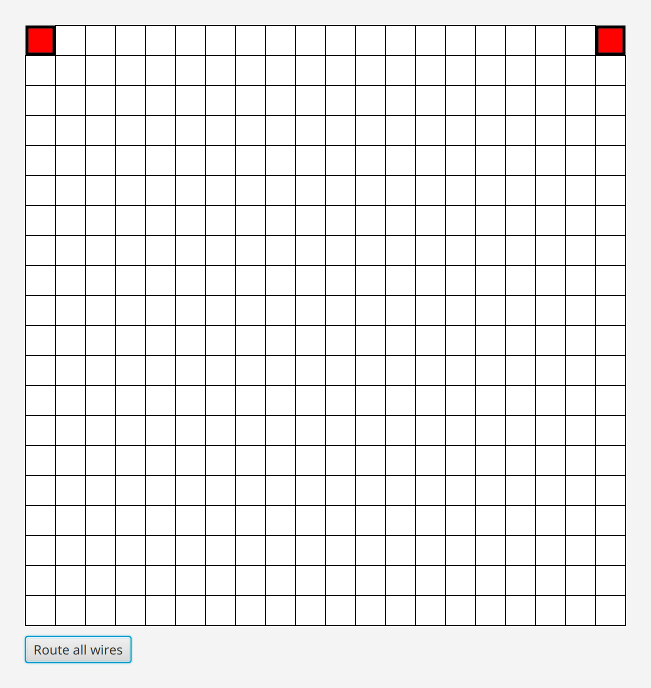
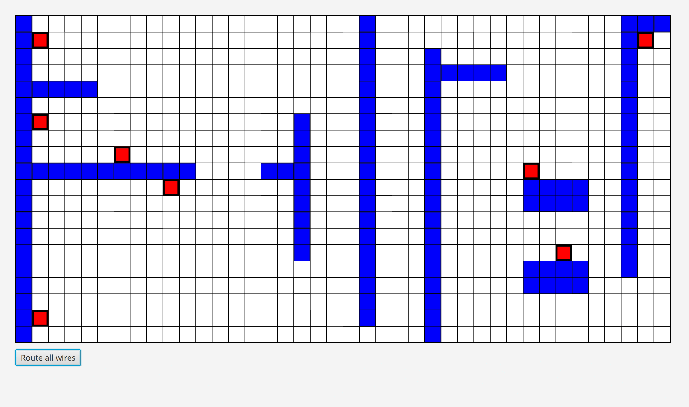
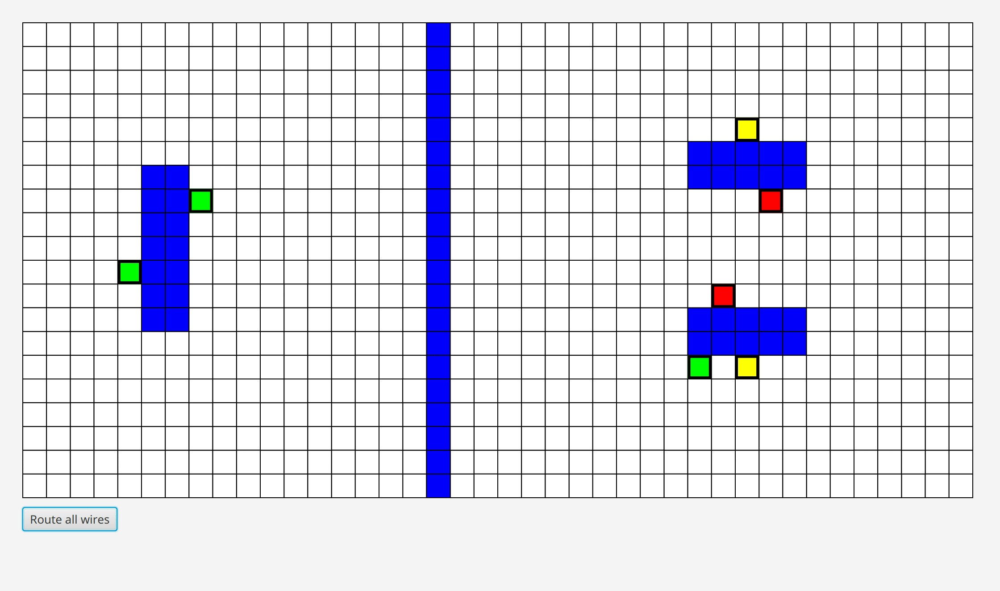

# Animations
## Algorithm variants
### 1. Lee-Moore

### 2. A*

## Routing of benchmarks with A* version
### 1. sydney

### 2. stanley

### 3. oswald

### 4. rusty

### 5. wavy

### 6. impossible2
