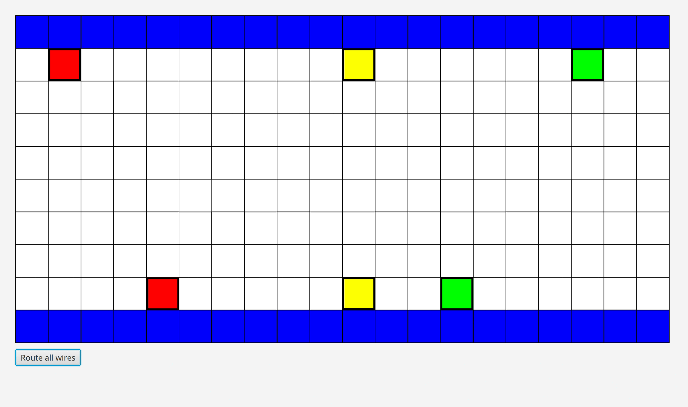
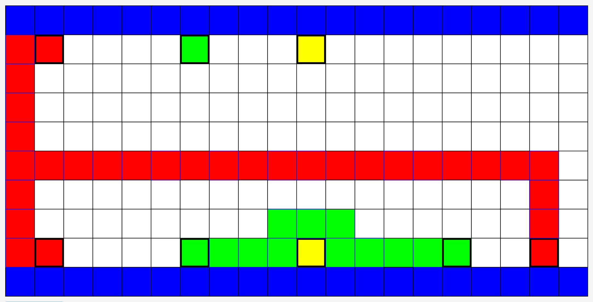
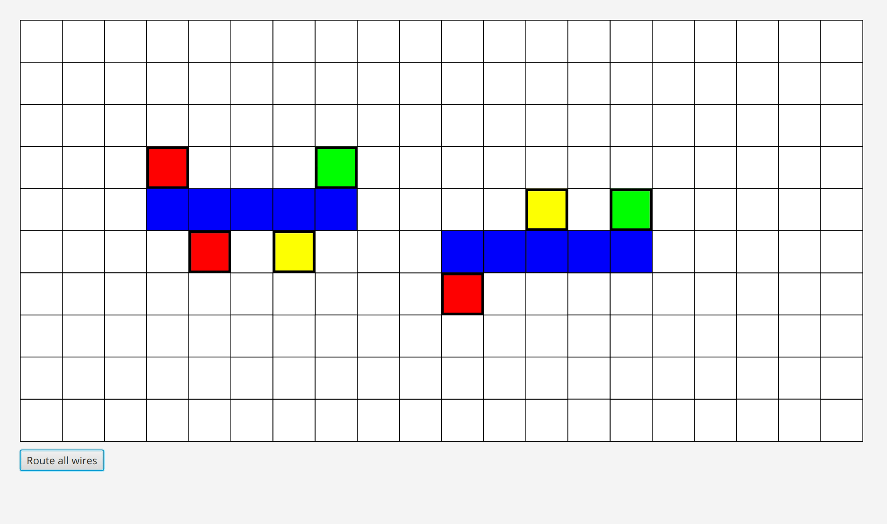
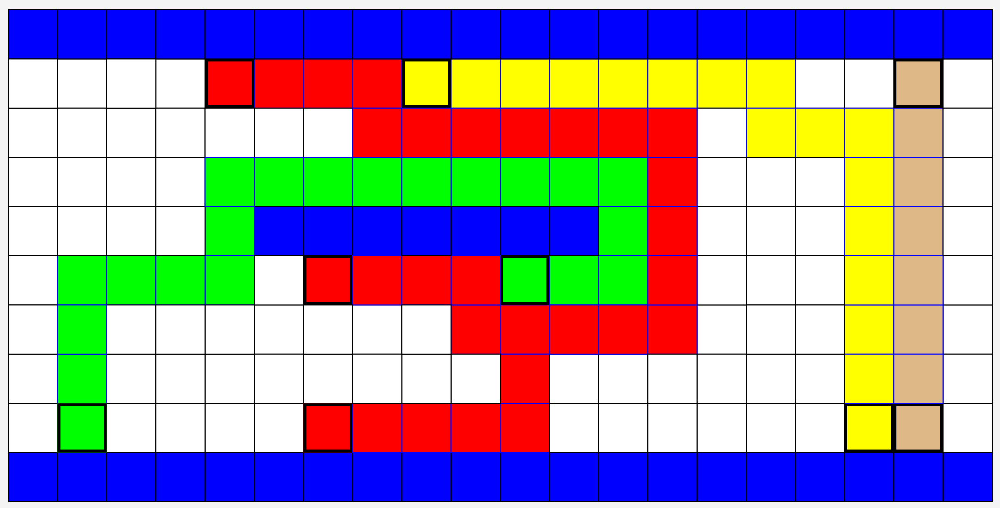
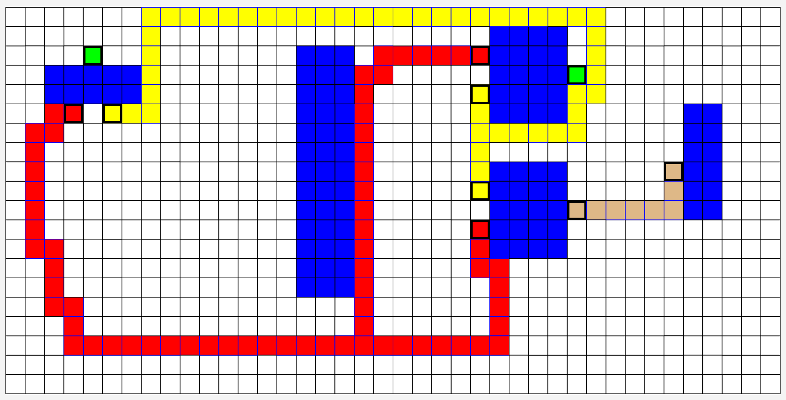

# Graphics
## Algorithm variants
### 1. Lee-Moore

### 2. A*

## Routing of benchmarks with A* version
### 1. sydney

### 2. stanley

### 3. impossible

### 4. oswald

### 5. rusty

### 6. misty

### 7. wavy

### 8. kuma

### 9. impossible2

### 10. stdcell

