# Graphics
## Algorithm variants
### 1. A*
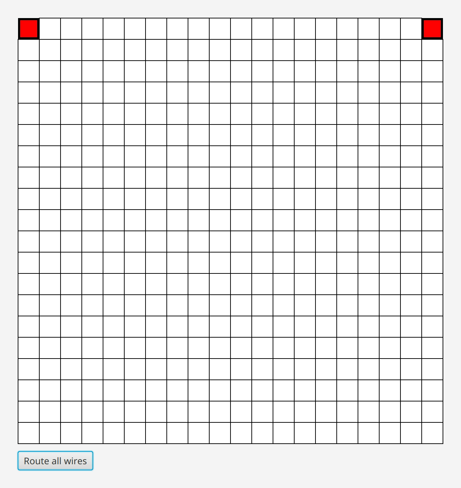

### 2. Lee-Moore

## Routing of benchmarks with A* version
### 1. sydney
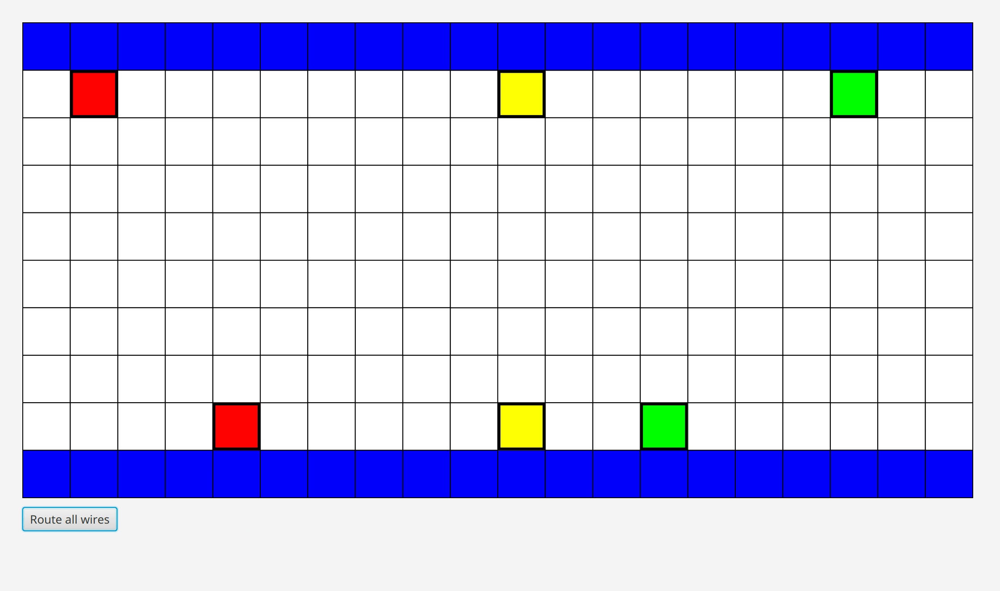

### 2. stanley

### 3. impossible
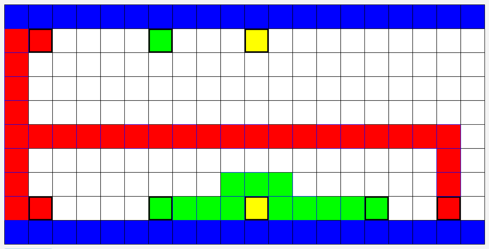

### 4. oswald

### 5. rusty

### 6. misty

### 7. wavy

### 8. kuma
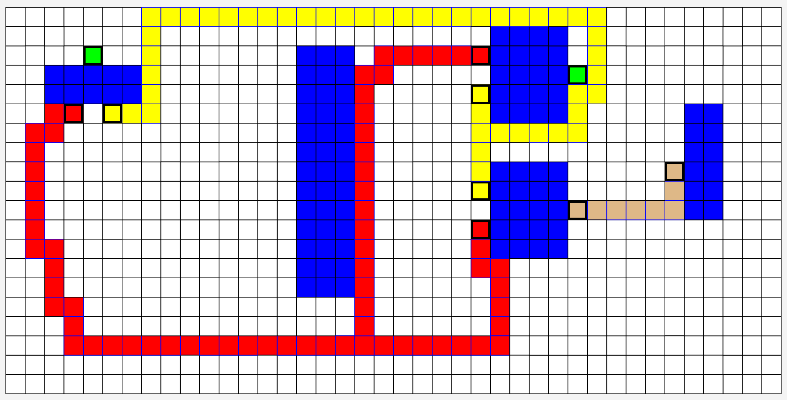

### 9. impossible2

### 10. stdcell

## Routing of benchmarks with Lee-Moore version
### 1. sydney
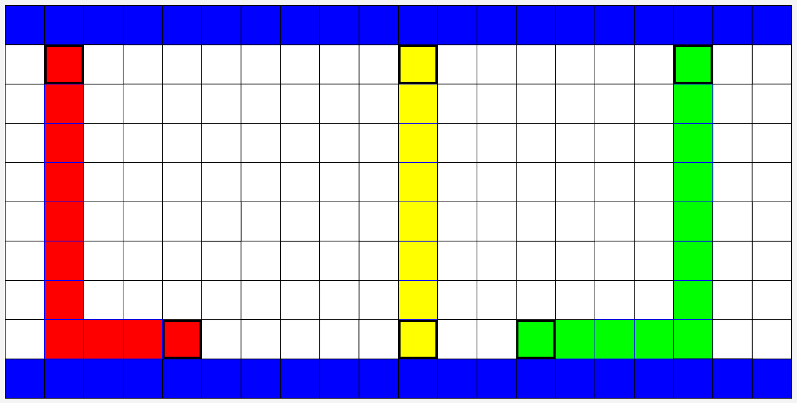

### 2. stanley
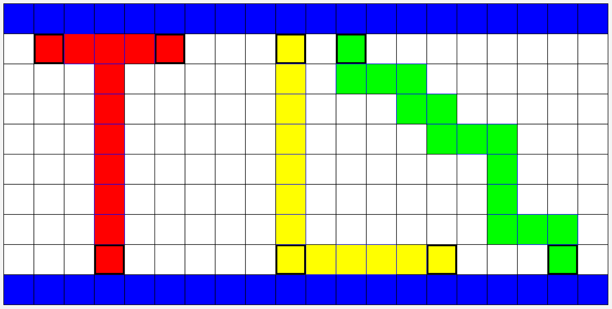

### 3. impossible
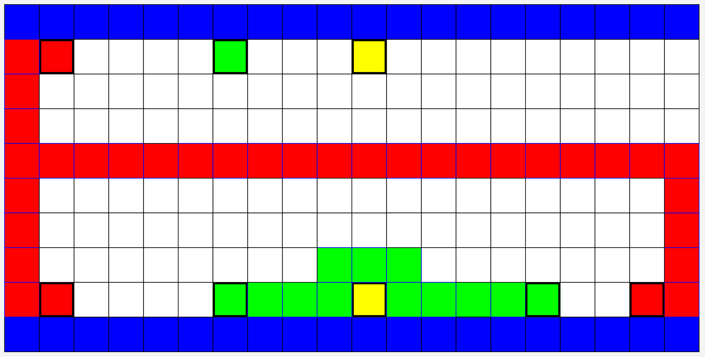

### 4. oswald
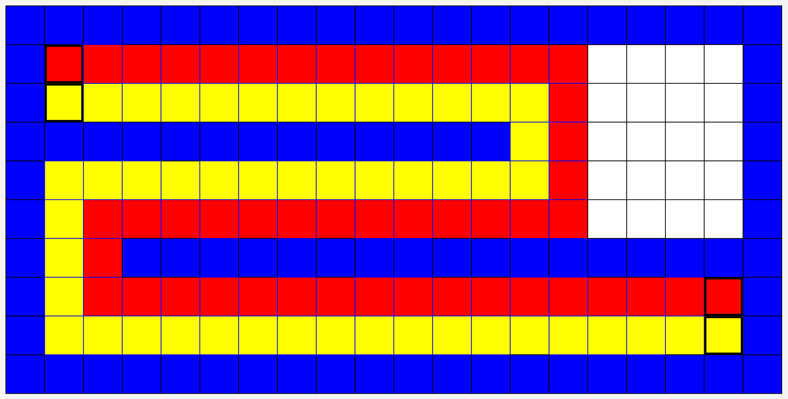

### 5. rusty
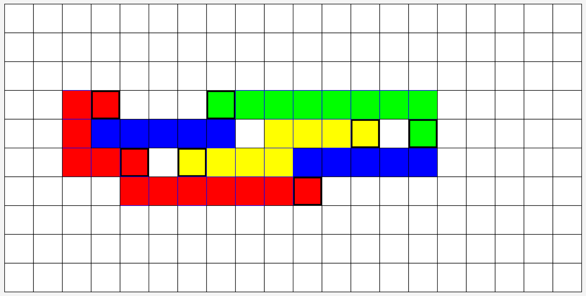

### 6. misty
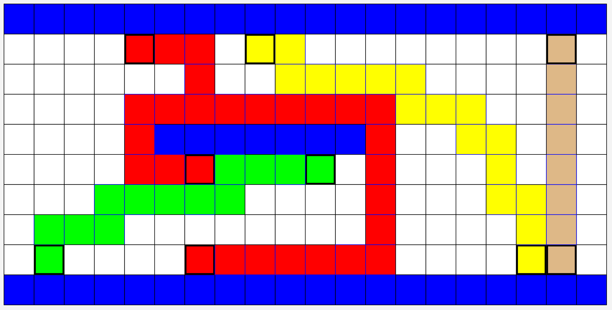

### 7. wavy
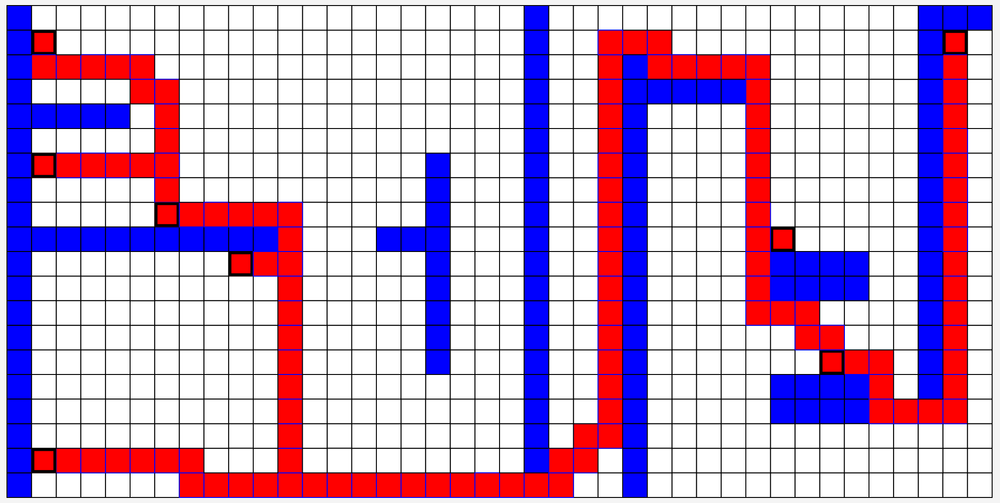

### 8. kuma
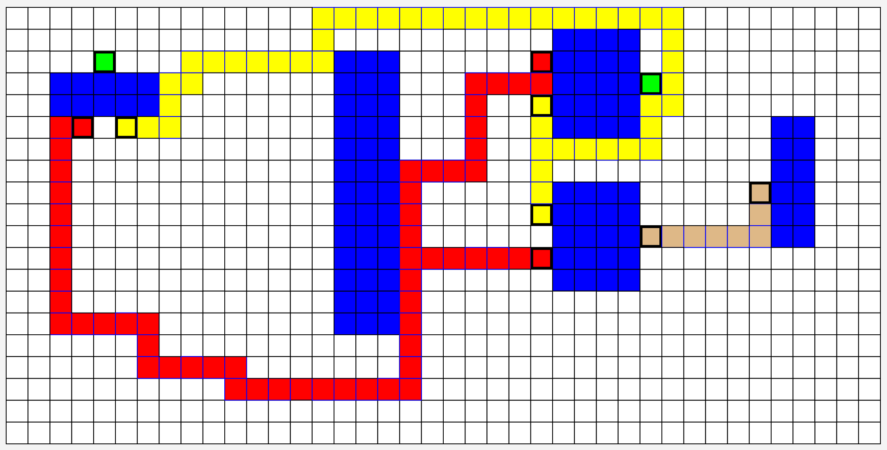

### 9. impossible2

### 10. stdcell
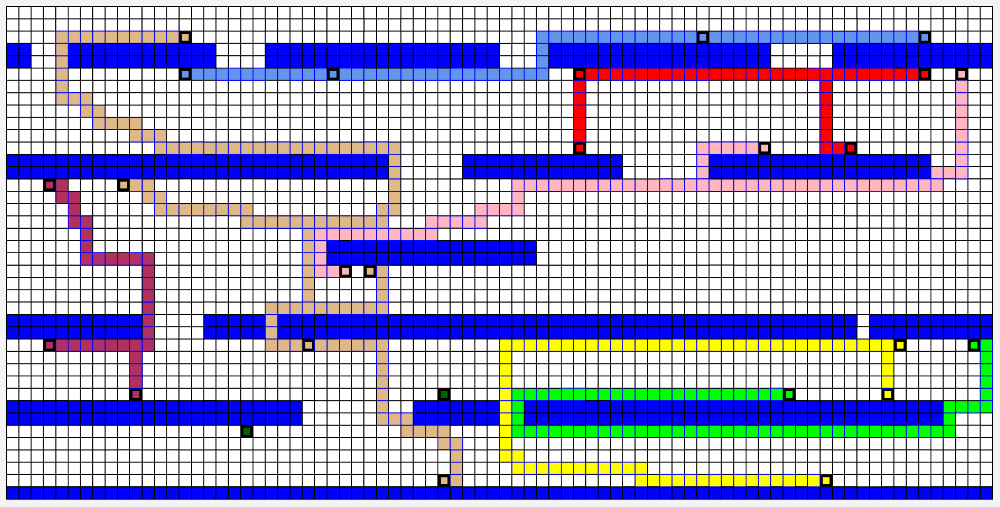
