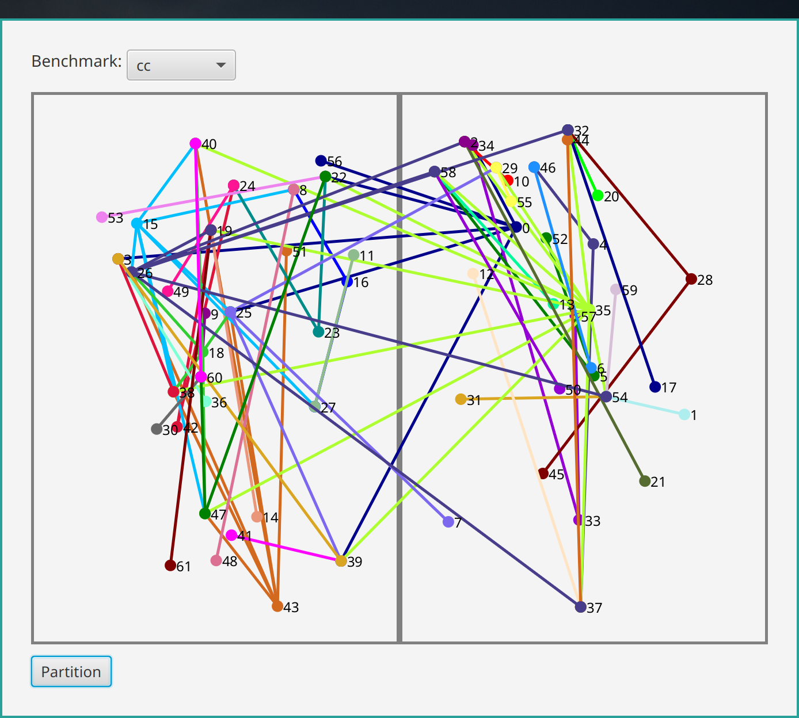
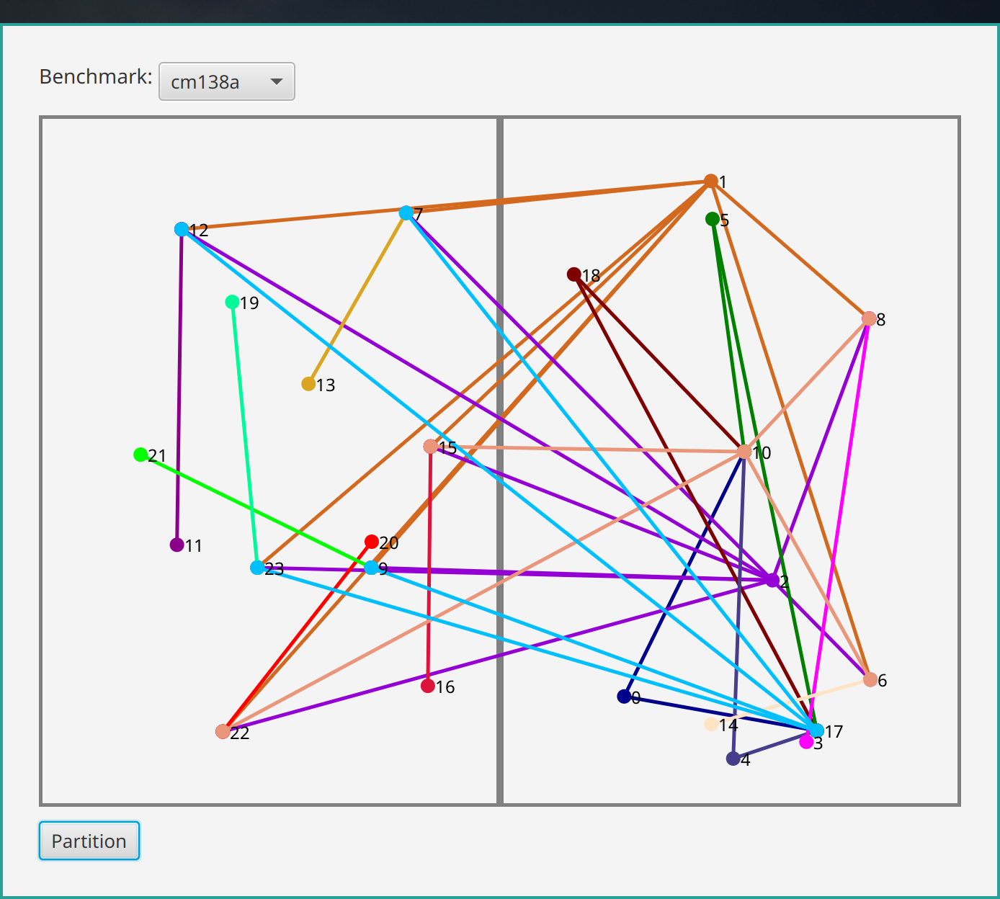
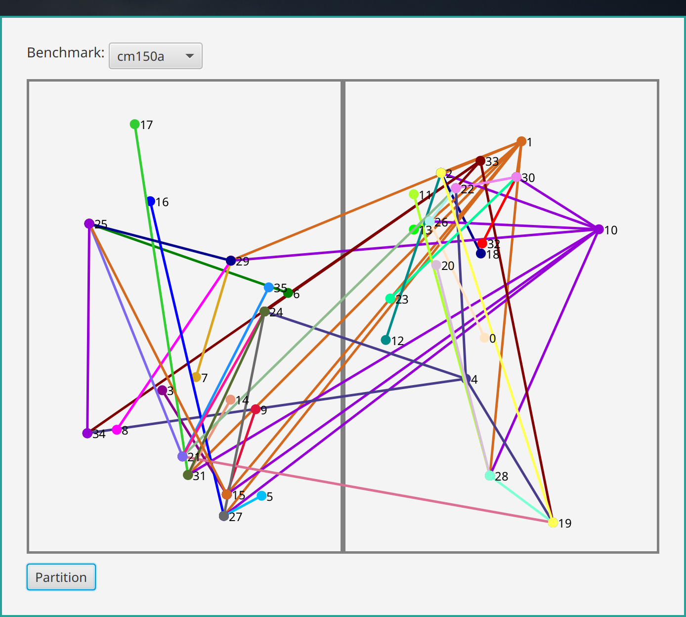
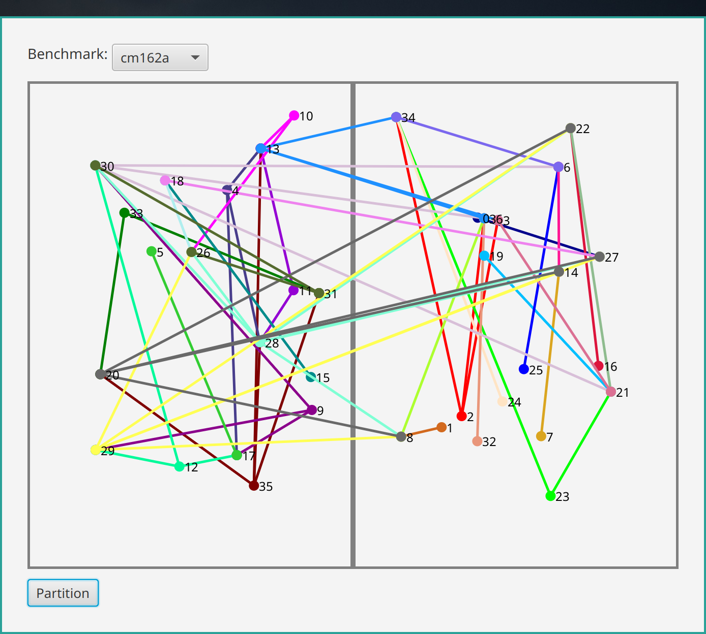
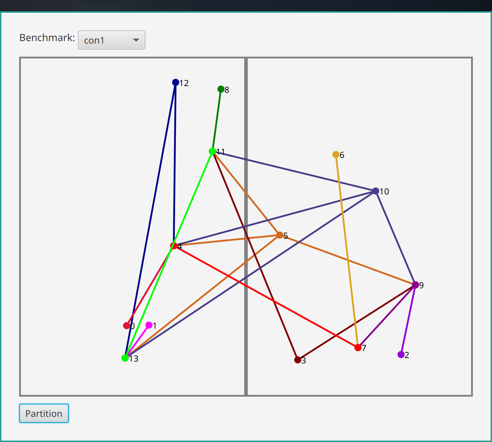
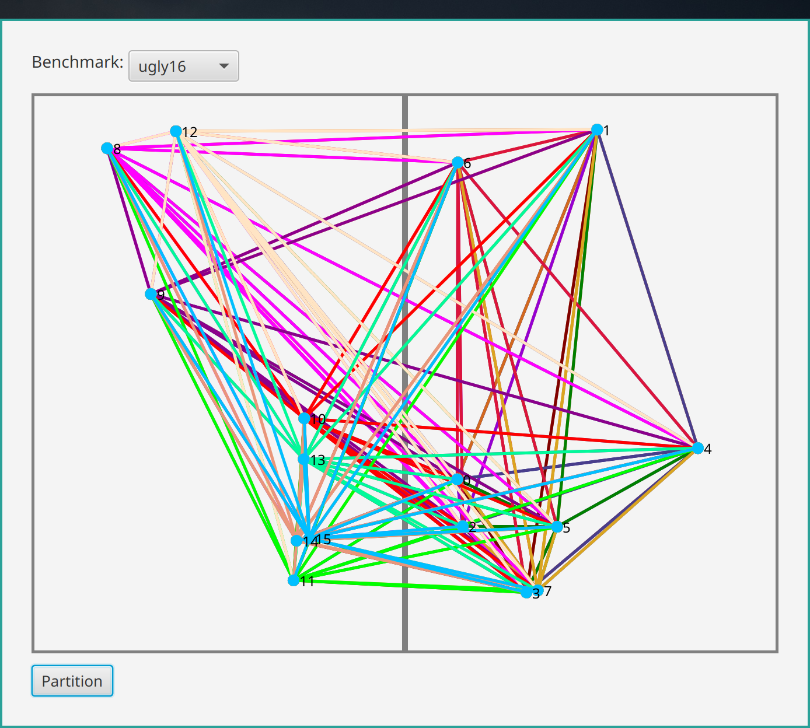
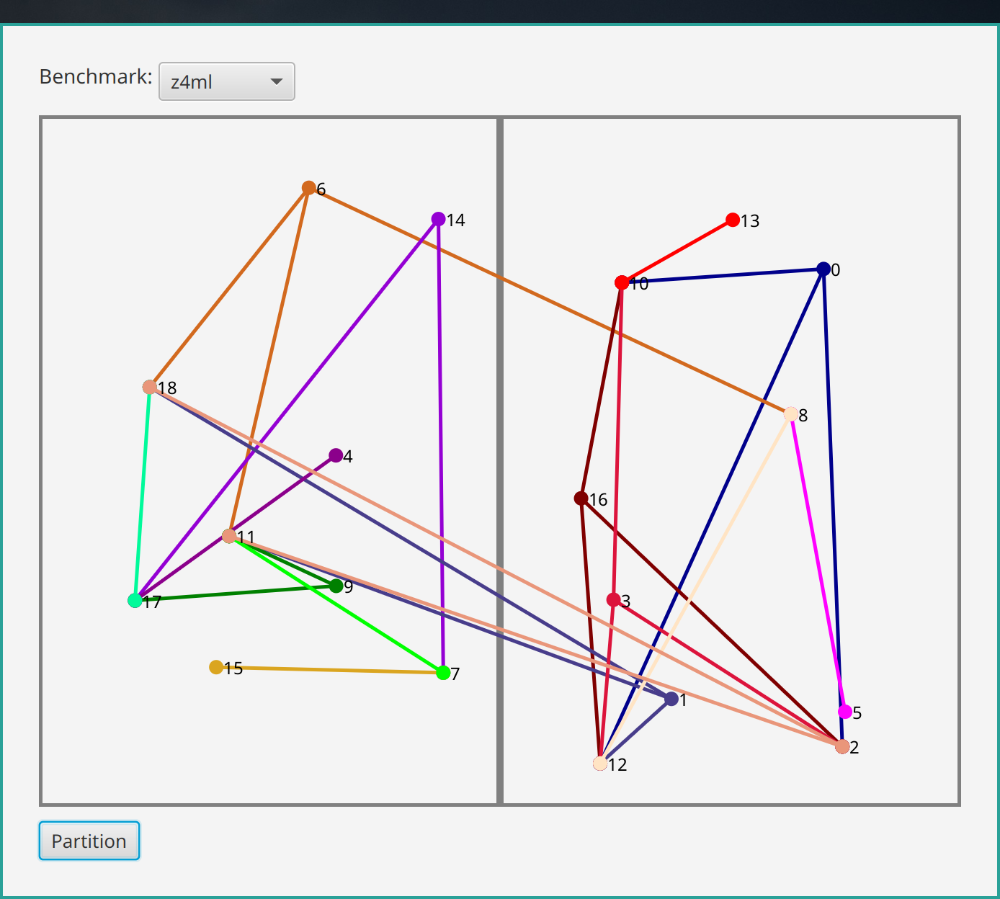
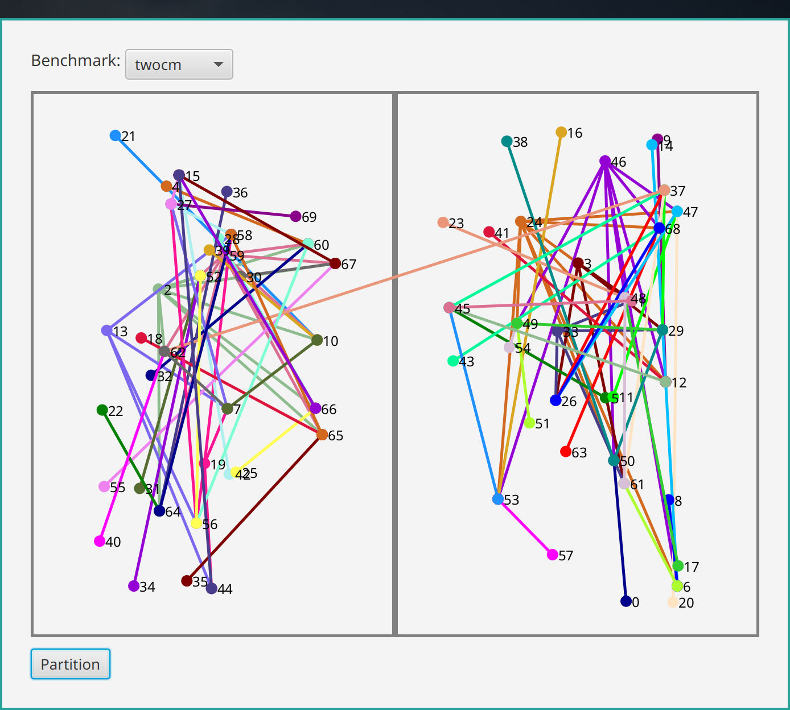

# Graphics
## Partition of benchmarks with Branch and Bound
### 1. cc

### 2. cm82a

### 3. cm138a

### 4. cm150a

### 5. cm162a

### 6. con1

### 8. ugly8

### 9. ugly16

### 10. z4ml

## Partition of benchmarks with Fiduccia–Mattheyses algorithm
### 9. twocm

